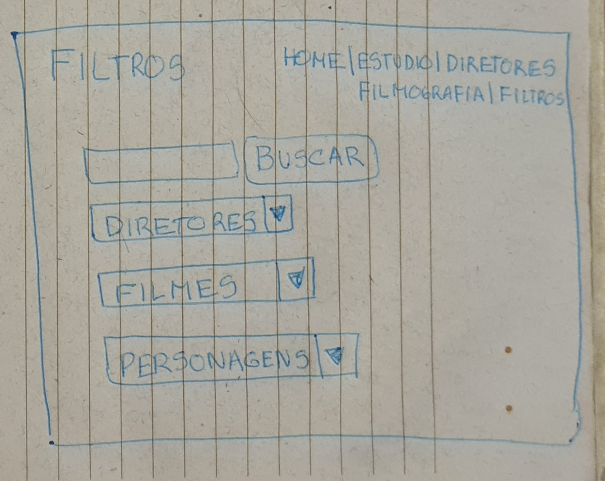

# Data Lovers 

## 
**Acesse o projeto:**

**Tecnologias utilizadas**

     

## Índice

* [Resumo do projeto](#resumo-do-projeto)
* [Protótipos](#protótipos)
* [Histórias de usuário](#histórias-de-usuário)
* [Testes de Usabilidade](#testes-de-usabilidade)
* [Objetivos de aprendizagem alcançados](#objetivos-de-aprendizagem-alcançados)
* [Considerações gerais](#considerações-gerais)
* [Dupla desenvolvedora](#dupla-desenvolvedora)

***

## Resumo do projeto

Neste projeto construimos uma _página web_ onde o usuário pode acessar uma série de dados sobre o [Stúdio Ghibli](https://studioghibli.com.br/), como filmografia, diretores e personagens.

A página permita que o usuário filtre, ordene e busque informações.

* [Studio Ghibli](src/data/ghibli/ghibli.json).
  Lista de animações e personagens do [Studio Ghibli](https://ghiblicollection.com/).
  - [Pesquisa com seguidores de Studio Ghibli](src/data/ghibli/README.pt-BR.md)

## Protótipos 

**Baixa fidelidade**

**Alta fidelidade**

## Histórias de usuário

Perfis dos usuários e observações:

Usuario 1: Adulto, 29 anos, sexo maculino, ensino superior completo, engenheiro de produção. Observações: não conhecia o conteúdo do site.

*Apenas como fonte de primeiras informações sobre filmes de animação japoneses, o site exibe um pouco sobre a história do estúdio e seus diretores. Também me disponibiliza ver todos os filmes produzidos e buscar apenas de um diretor específico, possibilitando assim que eu finalize minha navegação.* 

Usuario 2: Adulto, 32 anos, sexo feminino, ensino superior completo, produtora cultural audiovisual. Observações: estava familiarizada com o conteúdo do site e costuma frequentar sites de cinema e produções de TV.

*Como uma pessoa interessada em filmes, e tendo conhecimento na área, busca um site onde consiga encontrar informações específicas de cada filme do estúdio. Além da introdução sobre a origem do estúdio e dos diretores, preciso ver todos os filmes de determinado diretor. Ao buscar o nome de um filme, é importante que eu consiga ver informações da produção tirando assim minhas dúvidas sobre o tema.*

## Testes de Usabilidade

Comentários sobre o conteúdo, diagramação e funcionalidades:

Usuario 1: Acessado por celular, observou que alguns cards estavam com espaçamentos maiores que outros por conta do tamanho do conteúdo. Sugeriu que na página de entrada a área que o personagem aparece seja arredondada. Teve acesso facilmente a informação sem problemas no uso.

Usuario 2 : Acessado por celular e navegador. Observou o espaçamento entre os cards dos filtros dos filmes, sugeriu que ficasse como os dos personagens com menos conteúdo. Observou a necessidade de um botão para voltar ao topo que acompanhasse o scroll da tela no celular. Apreciou a uniformidade das cores e formatos. Achou bem explicativo o uso dos filtros, mas sugeriu um comentário de como usar os filtros para leigos.

## Objetivos de aprendizagem alcançados

- Uso de HTML semântico
- Uso de seletores de CSS
- Modelo de caixa (box model): borda, margem, preenchimento
- Uso de flexbox e grid em CSS
- Uso de seletores de DOM
- Manipulação de eventos de DOM (ouvintes, recebidos, recebidos)
- Arrays (arranjos)
- Objetos (chave, valor)
- Variáveis ​​(declaração, atribuição, escopo)
- Diferenciar entre tipos de dados primitivos e não primitivos
- Uso de condicionais (if-else, switch, operador ternário, lógica booleana)
- Funções (params, args, return)
- Testes unitários (testes unitários)
- Testes de usabilidade

## Considerações gerais

* Na excecução deste projeto utilizamos uma base de dados de um arquivo .json, priorizando a boa usabilidade para usuários familiarizados ou não com o tema, cumprindo as necessidades de suas histórias. Aplicamos as funcionalizades do JavaScript para filtrar e exibir informações. Buscamos ajustar o html e css da melhor maneira para manter uma harmonia no estilo da página. Os testes executados foram bem sucedidos e finalizamos a entrega.

** Projeto entregue através do GitHub
  [Projeto Data Lovers](https://pages.github.com/)

## Dupla desenvolvedora

Projeto desenvolvido por [Marina Cordeiro](https://github.com/Marinacb7) e [Vitória Victor](https://github.com/vitoriavictor)

  -*-*-*-*-